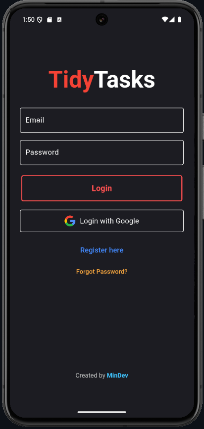
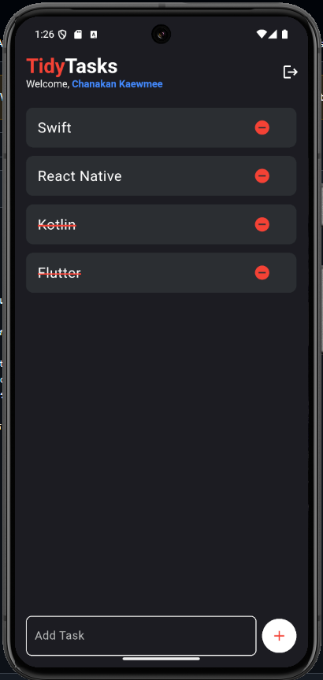
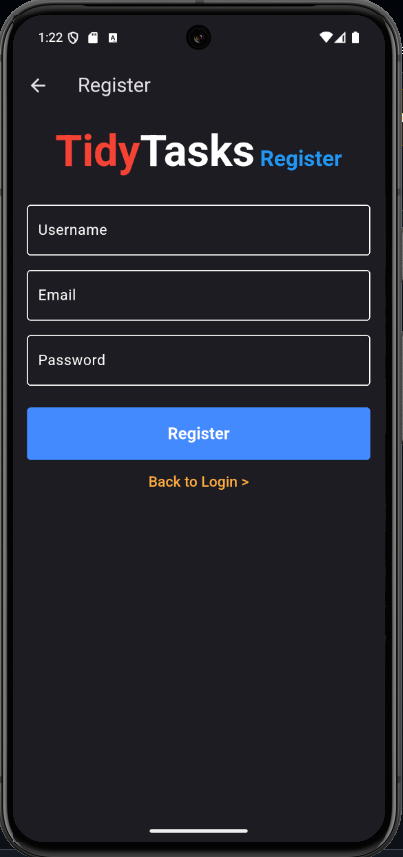

# 📱 TidyTasks App

**TidyTasks** is a minimalist and modern To-Do List application built with **Flutter** and powered by **Supabase**.  
It allows users to easily manage daily tasks, mark completed items, and keep things organized with a smooth user experience.

---

## 🚀 Features

- ✅ Email & Google Login (Supabase Auth)
- 📝 Create / Delete / Mark tasks as done
- ☁️ Realtime sync with Supabase database
- 🎨 Simple & clean UI using Flutter
- 👤 Profile with user info & logout
- 📦 Local + cloud data storage

---

## 🖼️ App Demos

<p align="center">
  
  
  
</p>


---

## 📂 Tech Stack

- **Frontend**: Flutter (Dart)
- **Backend**: Supabase (Auth + Database)
- **Storage**: Supabase Realtime Postgres
- **State Management**: `setState` (basic)

---

## 🧪 How to Run

1. Clone the repo:
   ```bash
   git clone https://github.com/your-username/tidytasks_flutter.git
   cd tidytasks_flutter
